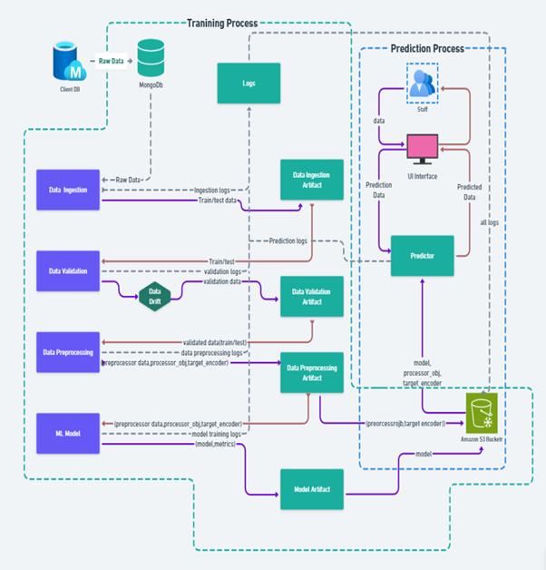
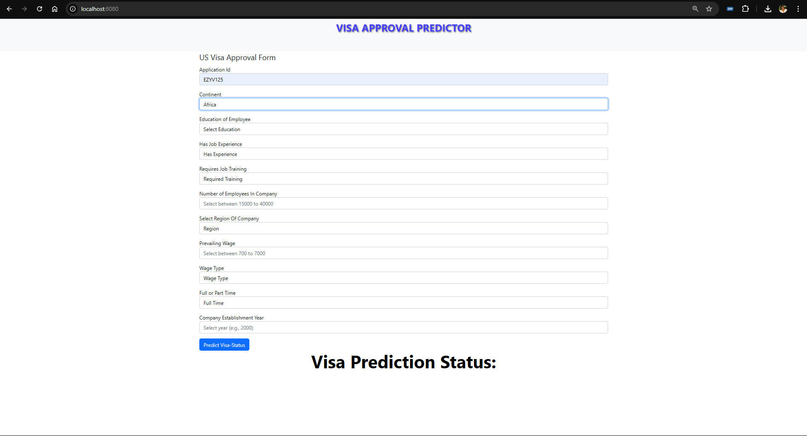

# Visa Approval Predictor

A web-based application for predicting U.S. visa approval status. This tool is designed to streamline the visa application process, helping users determine the likelihood of visa approval based on historical data and specific applicant information.


## Table of Contents

- [Overview](#overview)
- [Features](#features)
- [Installation](#installation)
- [Usage](#usage)
- [Demo](#demo)
- [Technical Details](#technical-details)
- [Contributing](#contributing)
- [License](#license)

## Overview

The **Visa Approval Predictor** is a machine learning-powered tool that predicts visa approval chances. It utilizes historical visa application data and analyzes various factors like the applicant's education, job experience, wage type, and more to generate predictions. This tool is particularly beneficial for organizations like the **Office of Foreign Labor Certification (OFLC)** to streamline visa processing and enhance decision-making.

## Features

- User-friendly web interface with a simple form input for applicant details.
- Machine learning model for real-time prediction of visa approval chances.
- Aesthetic design with centered headers, shadow effects, and clean form layouts.
- Built with FastAPI for backend and responsive frontend design.

## Installation

To get started with the Visa Approval Predictor, clone the repository and install the necessary dependencies.

### Prerequisites

- Python 3.9+
- [FastAPI](https://fastapi.tiangolo.com/)
- [MLflow](https://mlflow.org/)
- Other Python packages as listed in `requirements.txt`

### Steps

1. **Clone the repository:**

    ```bash
    git clone https://github.com/your-username/visa-approval-predictor.git
    cd visa-approval-predictor
    ```

2. **Create and activate a virtual environment:**

    ```bash
    python -m venv venv
    source venv/bin/activate  # On Windows, use `venv\Scripts\activate`
    ```

3. **Install dependencies:**

    ```bash
    pip install -r requirements.txt
    ```

4. **Run the application:**

    ```bash
    python app.py
    ```

5. **Access the application:**
   Open your browser and go to [http://localhost:8000](http://localhost:8000).


## Workflow   



## Usage

1. Enter the required information in the **US Visa Approval Form** (e.g., Application ID, Continent, Education, Job Experience).
2. Click **Predict Visa-Status**.
3. The **Visa Prediction Status** will display the result based on the input data.

## Demo

A live demo of the application showcasing the prediction process and UI can be found.




## Technical Details

- **Frontend:** Designed with HTML, CSS, and JavaScript for an interactive and responsive user experience.
- **Backend:** FastAPI for handling API requests and data processing.
- **Model Training and Logging:** MLflow is used for model management, allowing version control and experiment tracking.
- **Data Storage and Logging:** Prediction logs are stored in a dedicated `logs` folder for easy access and analysis.

## Contributing

We welcome contributions from the community. Please fork this repository, make your changes, and submit a pull request.

1. Fork the repository.
2. Create your feature branch (`git checkout -b feature/AmazingFeature`).
3. Commit your changes (`git commit -m 'Add some AmazingFeature'`).
4. Push to the branch (`git push origin feature/AmazingFeature`).
5. Open a pull request.

## License

Distributed under the MIT License. See `LICENSE` for more information.
